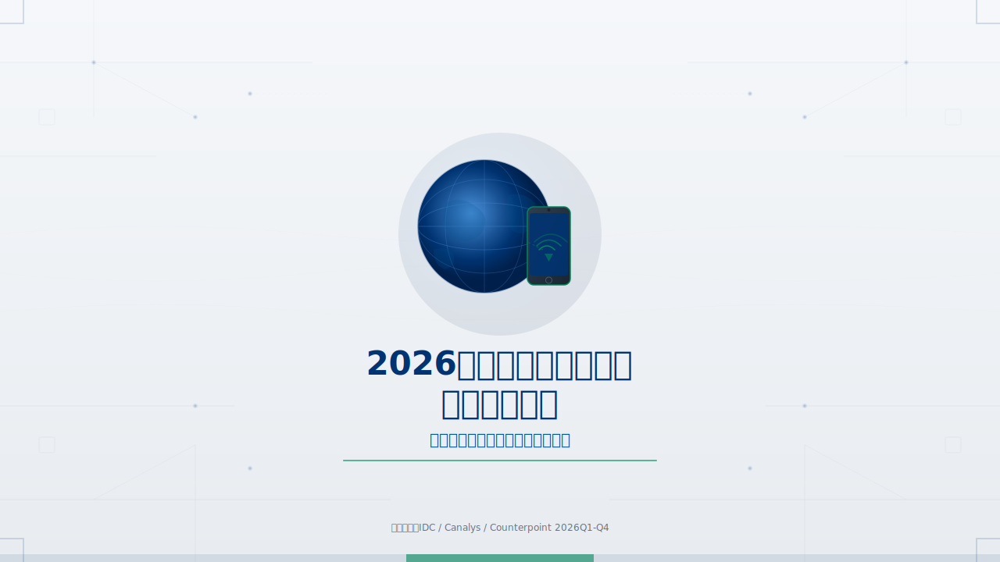
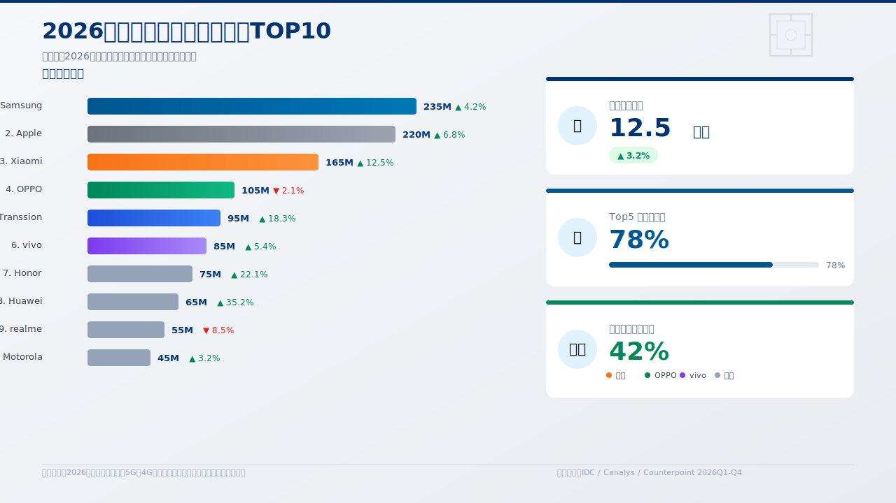
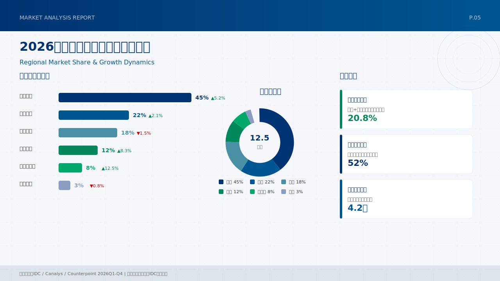

# PPT-SVGAgent

AI 驱动的 PPT 智能生成平台 —— 将自然语言描述或结构化大纲快速转换为专业级幻灯片。



---

## 🎯 项目简介

PPT-SVGAgent 是一款基于 AI 的演示文稿生成工具，支持：

- 📝 **主题分析** —— 输入主题描述，AI 自动规划幻灯片结构（大纲生成）
- 📋 **结构化导入** —— 支持"第X页：标题\n内容"格式批量创建页面，跳过 AI 调用，秒级完成
- 🎨 **多模板支持** —— 内置 20+ 专业设计模板（政府蓝、科技感、学术风格等）
- ⚡ **SVG 高质量渲染** —— 每个页面渲染为矢量 SVG，确保清晰度和跨平台兼容性
- 📤 **PPTX 导出** —— 一键导出可编辑的 PowerPoint 文件

---

## 🚀 快速开始

### 环境要求

- Python 3.10+
- Node.js 18+
- MiniMax API Key（或其他 OpenAI 兼容 API）

### 后端安装

```bash
cd backend

# 安装依赖
pip install -r requirements.txt

# 配置环境变量（复制模板后填入你的 API Key）
cp .env.example .env

# 启动服务
python app.py
```

后端运行于 `http://localhost:5031`

### 前端安装

```bash
cd frontend

# 安装依赖
npm install

# 开发模式启动
npx vite
```

前端运行于 `http://localhost:5200`

### 获取 API Key

1. 注册 [MiniMax](https://www.minimax.io/) 账号
2. 在控制台获取 API Key
3. 填入 `backend/.env` 文件的 `MINIMAX_API_KEY` 字段

---

## 📖 使用指南

### 方式一：AI 智能分析（输入主题描述）

1. 点击首页「新建项目」
2. 输入项目名称和主题描述（如：智能电网、数字化转型汇报等）
3. 点击「AI 生成大纲」—— AI 自动分析并生成结构化页面列表
4. 可编辑大纲内容后，点击「开始生成」



### 方式二：结构化快速导入（跳过 AI）

如果已有清晰的 PPT 内容结构，可以直接粘贴以下格式，跳过 AI 分析，**2 秒内完成全部页面创建**：

```
第1页：封面
标题：智能体在电网中的实用化应用研究
副标题：南方电网数字化转型实践

第2页：研究背景
标题：双碳目标下的数字化需求
内容要点：
- 国家战略：双碳目标与能源革命
- 行业趋势：电网智能化加速
- 技术驱动：大语言模型赋能

第3页：技术架构
标题：云-边-端协同架构
内容要点：
- 云侧：大模型理解与规划
- 边侧：本地推理与实时响应
- 端侧：传感采集与执行控制

第4页：实施路径
标题："知-感-知-执-学"五步闭环
内容要点：
- 知：行业知识库与大模型规划
- 感：SCADA/DCS/PLC 系统数据采集
- 知：边缘智能推理与决策
- 执：设备控制与保护操作
- 学：运维知识自学习与迭代

第5页：成果展示
标题：智能体在电网中的实用化成果
内容要点：
- 故障处理：平均 3 分钟定位，5 分钟隔离
- 负荷预测：准确率 92%+，峰谷调节自动化
- 运维效率：减少 60% 人工巡检工作量
- 经济效益：年节约成本 1200 万元
```

粘贴后点击「**确认所有页面**」→ 所有页面一次性保存并显示 ✅ 标记 → 直接点「开始生成」。

---

## 🎨 示例幻灯片

以下是实际生成效果示例（SVG 矢量格式，可无限放大）：

### 第 1 页：封面


### 第 2 页：章节页（研究背景）


### 第 5 页：内容页（实施路径）



### 第 10 页：结尾页（成果总结）


---

## 🗂️ 目录结构

```
ppt-agent/
├── backend/                      # Flask 后端
│   ├── app.py                   # 应用入口
│   ├── controllers/             # API 路由
│   │   ├── ppt_controller.py   # PPT 相关 API
│   │   └── settings_controller.py
│   ├── models/                  # 数据模型
│   │   ├── project.py
│   │   └── page.py
│   ├── services/                # 核心服务
│   │   ├── outline_generator.py     # 大纲解析（"第X页"格式支持）
│   │   ├── theme_analysis_service.py  # AI 主题分析
│   │   ├── ai_generation_service.py   # SVG 生成
│   │   └── svg_export_service.py     # PPTX 导出
│   ├── services/ai_providers/   # AI 提供商（MiniMax / OpenAI / Anthropic / Gemini）
│   ├── ppt_master_engine/       # SVG 渲染引擎
│   │   └── templates/          # 设计模板（20+）
│   │       ├── government_blue/    # 政府蓝
│   │       ├── ai_ops/            # AI 科技风
│   │       ├── academic_defense/   # 学术答辩
│   │       └── ...
│   └── .env.example            # 环境变量模板
├── frontend/                    # React + Vite 前端
│   └── src/
│       ├── api/client.ts       # API 客户端
│       ├── pages/
│       │   ├── HomePage.tsx       # 首页
│       │   └── WorkspacePage.tsx   # 工作区
│       └── components/
│           ├── workspace/
│           │   ├── PageEditorModal.tsx     # 页面编辑
│           │   ├── OutlineEditorModal.tsx   # 大纲编辑
│           │   └── GenerationProgress.tsx   # 生成进度
│           └── home/NewProjectModal.tsx     # 新建项目
├── docs/                       # 文档与截图
│   └── images/                 # 示例幻灯片 SVG
└── README.md
```

---

## 🔧 配置说明

### 环境变量（`.env`）

```bash
# MiniMax API（主要 AI 提供商）
MINIMAX_API_KEY=your-api-key-here
MINIMAX_CN_API_KEY=your-api-key-here

# 可选：其他 AI 提供商
# OPENAI_API_KEY=your-openai-key
# ANTHROPIC_API_KEY=your-anthropic-key
```

### 模板配置

前端可在工作区更换模板，当前支持：

| 模板 | 风格 | 适用场景 |
|------|------|----------|
| `government_blue` | 深蓝政务风 | 政府/央企汇报 |
| `government_red` | 红金党政风 | 党建/红色主题 |
| `ai_ops` | 科技蓝黑 | AI/科技公司 |
| `academic_defense` | 学术蓝白 | 论文答辩/学术 |
| `google_style` | 简约多彩 | 互联网/创意 |
| `china_telecom_template` | 运营商蓝 | 通信/电信行业 |

---

## 🛠️ 技术架构

### 后端技术栈

- **Flask** —— 轻量级 Python Web 框架
- **SQLAlchemy** —— ORM 数据库抽象
- **SQLite** —— 开发环境数据库（生产可用 PostgreSQL/MySQL）
- **MiniMax API** —— 主要文本生成（OpenAI 兼容接口）
- **备用提供商** —— OpenAI / Anthropic / Gemini / Qwen / DeepSeek

### 前端技术栈

- **React 18** —— 组件化 UI 框架
- **Vite** —— 快速构建工具
- **TypeScript** —— 类型安全
- **Tailwind CSS** —— 实用优先样式
- **Zustand** —— 轻量状态管理
- **React Router** —— 页面路由

### SVG 渲染引擎

ppt_master_engine 负责将 AI 生成的内容填充到 SVG 模板中，生成高质量矢量幻灯片。最终通过 svg2png + python-pptx 导出为可编辑 PPTX 文件。

---

## 📋 更新日志

### v1.0.0（2026-05）
- ✅ AI 主题分析与结构化大纲生成
- ✅ "第X页"格式快速导入（无需 AI，秒级完成）
- ✅ 多 AI 提供商支持（MiniMax / OpenAI / Anthropic / Gemini）
- ✅ 20+ 专业模板
- ✅ SVG 高质量渲染
- ✅ PPTX 批量导出
- ✅ 统一确认保存（批量保存页面大纲）

---

## 📄 许可证

MIT License

---

## 👤 作者

GitHub: [junnylin8586-eng](https://github.com/junnylin8586-eng)

如有问题或建议，欢迎提交 Issue。